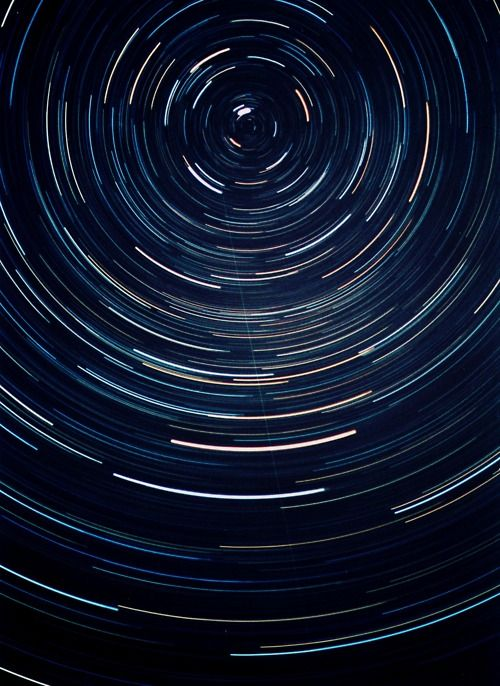
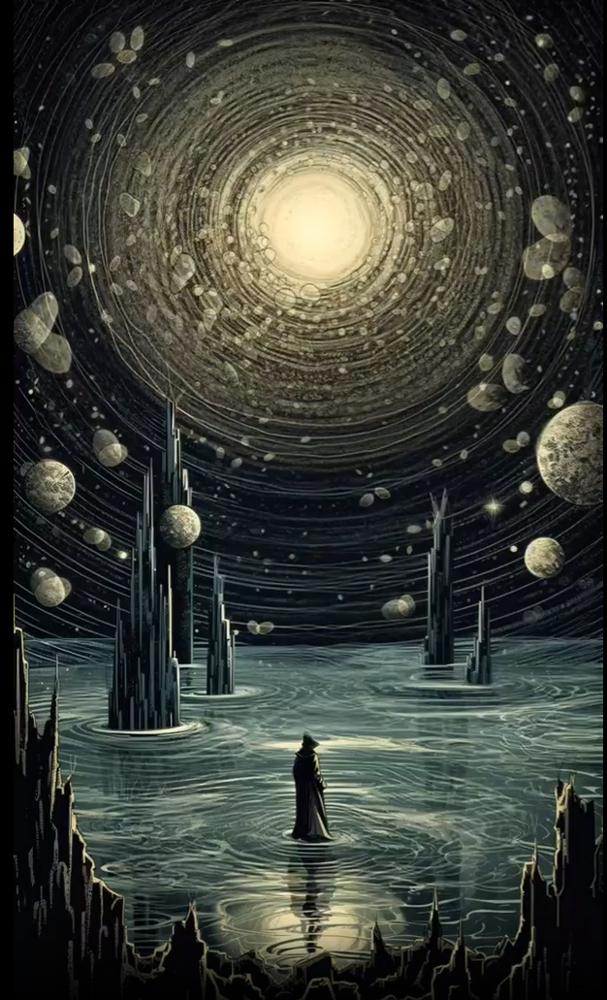
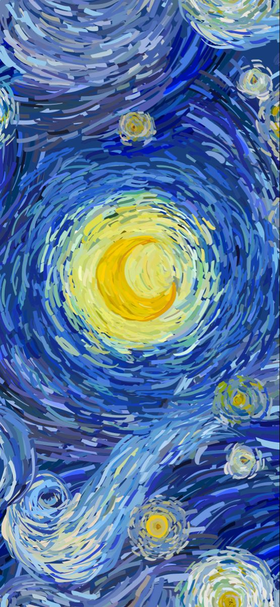
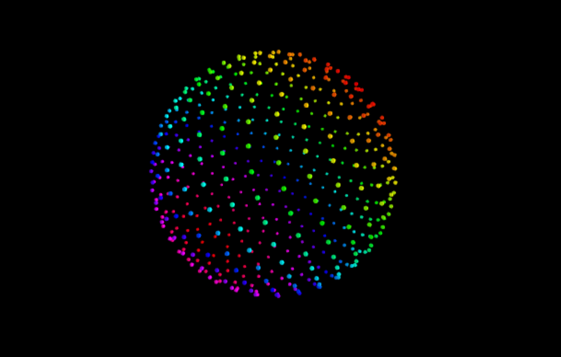

# QUIZ 8
### Part 1: Imaging Technique Inspiration
Inspired by the picture of the starry sky and orbit (*image 1*), I created an interactive starry sky that can be zoomed in and out by the mouse. It gives the user a feeling of being in the starry sky. I will use the loose arrangement of the circles in picture (*image 2*) to create an extended effect, and add planets to embellish the picture. To highlight the colour of the canva, the colour value of the painting of the starry sky (*image 3*) is brought into the circle of the picture. Through simple lines and patterns, a strong and interactive picture is created. 

- *image 1*
  
    

- *image 2*
  
   

- *image 3*
  
   

### Part 2: Coding Technique Exploration
  
In the sample code, the user can use the mouse zoom function to achieve the full angle of the pattern (*image 4*) free view. I will use this technique to achieve the effect of displaying the planet from far to near. In addition, I will study the 3d visual effects in the code to create a sense of space by using flat shapes. Try to develop a sense of tunnel space and 3d visual effects using circular lines. **Here is the link to the sample code provided:**
[Link code](https://editor.p5js.org/jcponce/sketches/vqhwg6lex)

- *image 4*
  
   

 
